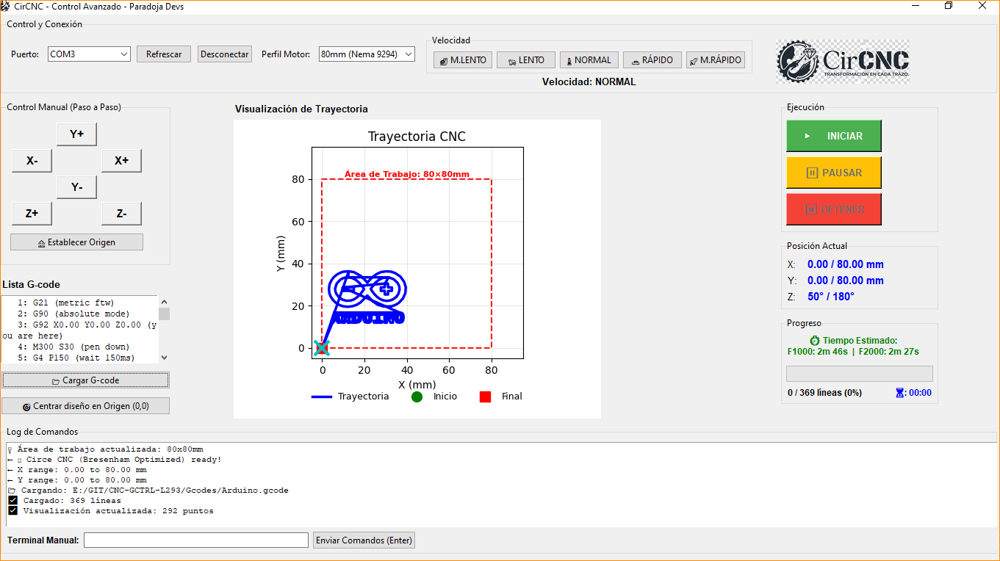

# CirCNC


```
  _____ _                _   _  _____ 
 / ____(_)              | \ | |/ ____|
| |     _ _ __ ___ ___  |  \| | |     
| |    | | '__/ __/ _ \ | . ` | |     
| |____| | | | (_|  __/ | |\  | |____ 
 \_____|_|_|  \___\___| |_| \_|\_____|
```

## Descripción
**CirCNC** es una aplicación avanzada inspirada en Circe, la diosa hechicera de la mitología griega, evocando los conceptos de **transformación** y **control**. Al igual que ella transformaba la realidad con precisión, esta herramienta permite convertir diseños digitales en movimientos mecánicos exactos.

Desarrollada por 'Paradoja Developers', permite controlar máquinas CNC mediante comandos G-code. La interfaz gráfica proporciona una forma intuitiva de cargar, ejecutar y monitorear programas G-code, además de ofrecer controles manuales para la máquina.

## Características Principales
- Interfaz gráfica completamente redimensionable y modular
- Conexión serial con la máquina CNC
- Carga e interpretación de archivos G-code
- Visualización de trayectoria G-code en tiempo real
- Control manual de ejes (X, Y) y Servo (Z)
- Monitoreo en tiempo real de la posición y progreso
- Cálculo de tiempo estimado y alerta de trabajo completado
- Función para centrar automáticamente el diseño en el origen (0,0)
- Control de velocidad en 5 niveles para movimientos manuales
- Terminal Serial manual para enviar comandos interactivos

## Requisitos del Sistema
- Python 3.x
- Sistema operativo: Windows/Linux/MacOS
- Conexión serial con la máquina CNC

## Dependencias
```
pyserial
tkinter
```

## Instalación
1. Clonar o descargar este repositorio
2. Instalar las dependencias:
```bash
pip install pyserial
```
3. Ejecutar la aplicación:
```bash
python gctrl.py
```

## Uso
1. Conectar la máquina CNC al puerto serial
2. Seleccionar el puerto correcto en la interfaz
3. Cargar un archivo G-code
4. Utilizar los controles para operar la máquina

### Controles Manuales
- **Origen**: Mueve la máquina a la posición de origen
- **Motor X/Y**: Controla el movimiento en los ejes X e Y
- **Servo**: Controla el eje Z
- **Velocidad**: Ajusta la velocidad de movimiento (Lenta/Media/Rápida)

### Controles de Programa
- **Iniciar**: Comienza la ejecución del G-code
- **Pausar**: Pausa la ejecución actual
- **Detener**: Detiene la ejecución
- **¡EMERGENCIA!**: Detiene inmediatamente la máquina

## Capturas de Pantalla




## Pruebas

El proyecto incluye una suite completa de pruebas automatizadas para garantizar la calidad y facilitar el montaje del aplicativo.

### Ejecutar Pruebas
```bash
# Instalar dependencias de prueba
pip install -r requirements.txt

# Ejecutar todas las pruebas
pytest

# Ejecutar con salida detallada
pytest -v
```

### Cobertura de Pruebas
- **85 pruebas unitarias**: Validan componentes individuales
  - 30 tests: Controlador G-code
  - 22 tests: Puerto Arduino
  - 33 tests: Orígenes de motores
- **44 pruebas de integración**: Validan flujos de trabajo completos
  - 16 tests: Flujos generales
  - 28 tests: Integración con Arduino

**Total: 129 pruebas automatizadas**

Para más información, consulte [TESTING.md](TESTING.md).

## Contribuciones
Las contribuciones son bienvenidas. Por favor, abre un issue para discutir los cambios propuestos.

## Licencia
[Agregar información de licencia]

## Contacto
[Agregar información de contacto]

## Referencias

https://www.marginallyclever.com/2013/08/how-to-build-an-2-axis-arduino-cnc-gcode-interpreter/
https://github.com/damellis/gctrl
https://github.com/MakerBlock/TinyCNC-Sketches/tree/master
https://www.instructables.com/search/?q=cnc%20l293&projects=featured
https://wiki.opensourceecology.org/wiki/Gctrl#Problems_and_Solutions
