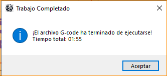

# Controlador G-code

## Descripción
Controlador G-code es una aplicación desarrollada por 'Paradoja Developers' que permite controlar máquinas CNC mediante comandos G-code. La interfaz gráfica proporciona una forma intuitiva de cargar, ejecutar y monitorear programas G-code, además de ofrecer controles manuales para la máquina.

## Características Principales
- Conexión serial con la máquina CNC
- Carga y ejecución de archivos G-code
- Control manual de ejes (X, Y, Z)
- Monitoreo en tiempo real de la posición
- Control de velocidad ajustable
- Parada de emergencia
- Visualización de comunicación serial
- Prueba de límites de la máquina
- Establecimiento de origen

## Requisitos del Sistema
- Python 3.x
- Sistema operativo: Windows/Linux/MacOS
- Conexión serial con la máquina CNC

## Dependencias
```
pyserial
tkinter
```

## Instalación
1. Clonar o descargar este repositorio
2. Instalar las dependencias:
```bash
pip install pyserial
```
3. Ejecutar la aplicación:
```bash
python gctrl.py
```

## Uso
1. Conectar la máquina CNC al puerto serial
2. Seleccionar el puerto correcto en la interfaz
3. Cargar un archivo G-code
4. Utilizar los controles para operar la máquina

### Controles Manuales
- **Origen**: Mueve la máquina a la posición de origen
- **Motor X/Y**: Controla el movimiento en los ejes X e Y
- **Servo**: Controla el eje Z
- **Velocidad**: Ajusta la velocidad de movimiento (Lenta/Media/Rápida)

### Controles de Programa
- **Iniciar**: Comienza la ejecución del G-code
- **Pausar**: Pausa la ejecución actual
- **Detener**: Detiene la ejecución
- **¡EMERGENCIA!**: Detiene inmediatamente la máquina

## Capturas de Pantalla




## Pruebas

El proyecto incluye una suite completa de pruebas automatizadas para garantizar la calidad y facilitar el montaje del aplicativo.

### Ejecutar Pruebas
```bash
# Instalar dependencias de prueba
pip install -r requirements.txt

# Ejecutar todas las pruebas
pytest

# Ejecutar con salida detallada
pytest -v
```

### Cobertura de Pruebas
- **113 pruebas unitarias**: Validan componentes individuales
- **28 pruebas de integración con Arduino**: Validan flujos de trabajo completos
- **16 pruebas de integración general**: Validan flujos de trabajo del sistema

**Total: 129 pruebas automatizadas**

Para más información, consulte [TESTING.md](TESTING.md).

## Contribuciones
Las contribuciones son bienvenidas. Por favor, abre un issue para discutir los cambios propuestos.

## Licencia
[Agregar información de licencia]

## Contacto
[Agregar información de contacto] 

## Referencias 

https://www.marginallyclever.com/2013/08/how-to-build-an-2-axis-arduino-cnc-gcode-interpreter/
https://github.com/damellis/gctrl
https://github.com/MakerBlock/TinyCNC-Sketches/tree/master
https://www.instructables.com/search/?q=cnc%20l293&projects=featured
https://wiki.opensourceecology.org/wiki/Gctrl#Problems_and_Solutions
